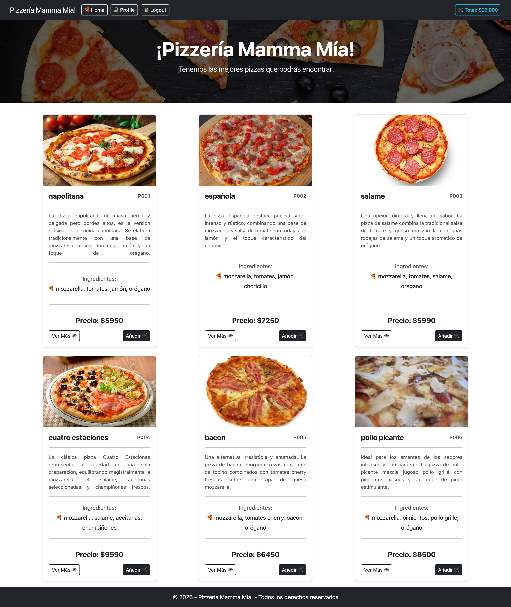
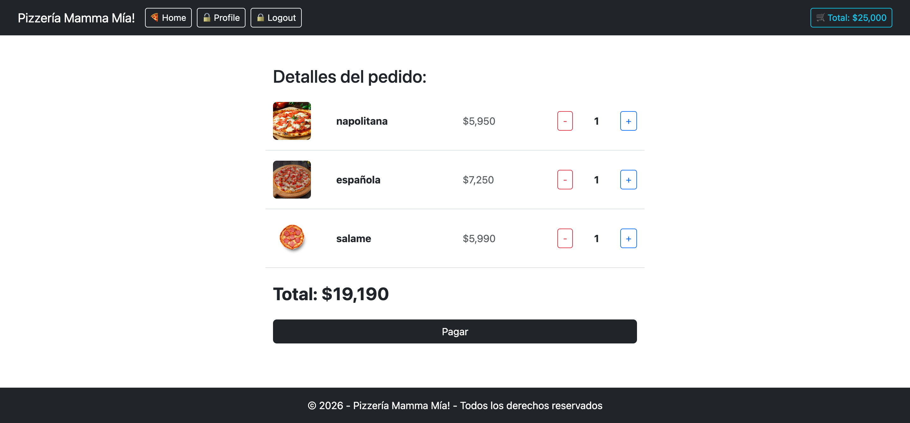

# 🍕 Pizzería Mamma Mía! - Hito 3: Renderización Dinámica y Carrito de Compras

Aplicación web desarrollada en **React** y **React-Bootstrap**, correspondiente al **Hito 3** del curso de desarrollo frontend. Este proyecto se centra en la renderización dinámica de componentes a partir de arreglos de datos, el uso de props, y la implementación de un carrito de compras interactivo mediante hooks de estado (`useState`).

---
## 🔗 Enlace al Proyecto
Puedes ver el sitio en funcionamiento a través de GitHub Pages:
👉 [https://jleival.github.io/hito-3-pizzeria-mamma-mia/](https://jleival.github.io/hito-3-pizzeria-mamma-mia/)

---
## 📸 Vistas Previas del Proyecto

### 🖥️ Vista de Escritorio (Catálogo General)
Visualización general del diseño adaptado para pantallas de escritorio, mostrando las pizzas disponibles, sus ingredientes, precios y opciones de interacción.

<p align="center">
  
</p>

### 🛒 Vista del Carrito de Compras
Interfaz dinámica del carrito donde se gestiona el incremento y decremento de cantidades, cálculo automático del valor total y visualización de los productos seleccionados.

<p align="center">
  
</p>

---

## 🚀 Características del Hito 3

* **Renderización Dinámica en Home:** Importación y recorrido de un arreglo de pizzas (`pizzas.js`) utilizando el método `.map()` para generar de forma dinámica los componentes `<CardPizza />`.
* **Listado de Ingredientes:** Iteración por la lista de ingredientes de cada pizza para mostrarlos de forma limpia mediante elementos `<li>` con sus respectivas propiedades `key`.
* **Simulación de Carrito de Compras (`<Cart />`):**
  * Carga dinámica de productos desde un arreglo simulado (`pizzaCart`).
  * Uso del hook `useState` para controlar el estado del carrito de manera reactiva.
  * Botones interactivos para **aumentar** y **disminuir** la cantidad de cada producto.
  * Lógica de eliminación automática de productos cuando su cantidad llega a cero (`0`).
* **Cálculo de Totales:** Suma automática del costo total de los productos en el carrito utilizando métodos de arreglos en JavaScript (`reduce`).

---

## 🛠️ Tecnologías Utilizadas

* **React** (Biblioteca de JavaScript para interfaces de usuario)
* **Vite** (Entorno de desarrollo rápido)
* **React-Bootstrap & Bootstrap** (Estilos y componentes responsivos)
* **JavaScript (ES6+)**
* **Git & GitHub** (Control de versiones)

---

## 📂 Estructura de Componentes Principales

* `App.jsx`: Componente principal que gestiona las vistas de la aplicación (con secciones comentadas para hitos anteriores y el componente de carrito activo).
* `Navbar.jsx`: Barra de navegación superior con diseño responsivo y botones de control de sesión / total.
* `Home.jsx`: Vista principal que recorre el catálogo de pizzas y renderiza las tarjetas.
* `CardPizza.jsx`: Componente reutilizable de tarjeta que muestra la imagen, nombre, precio e ingredientes renderizados mediante listas.
* `Cart.jsx`: Componente interactivo que administra el pedido, las cantidades y el monto total de la compra.

---

## ⚙️ Instalación y Ejecución Local

Sigue estos pasos para clonar y ejecutar el proyecto en tu máquina local:

1. **Clona el repositorio:**
   ```bash
   git clone https://github.com/jleival/hito-3-pizzeria-mamma-mia.git
   1. Entra al directorio del proyecto:
   cd nombre-del-proyecto
   2. Instala las dependencias:
   npm install
   3. Inicia el servidor de desarrollo:
   npm run dev
---
## 📝 Autor
Jorge Leiva

Proyecto desarrollado en el marco de la Academia Talento Digital / Desafío Latam.
